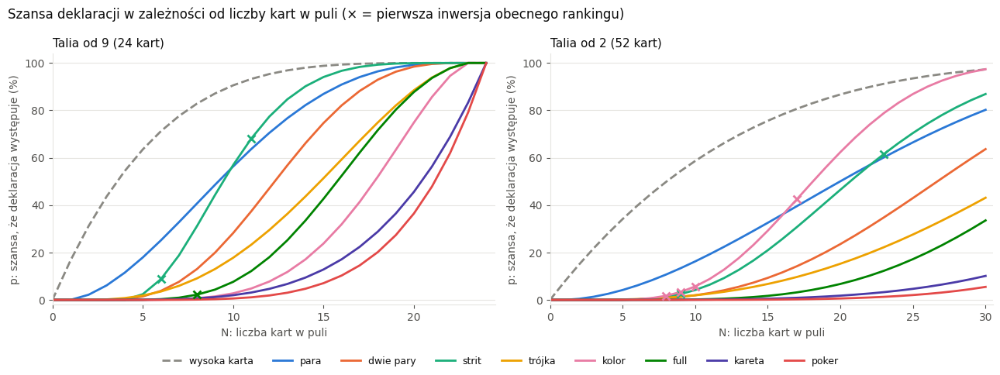
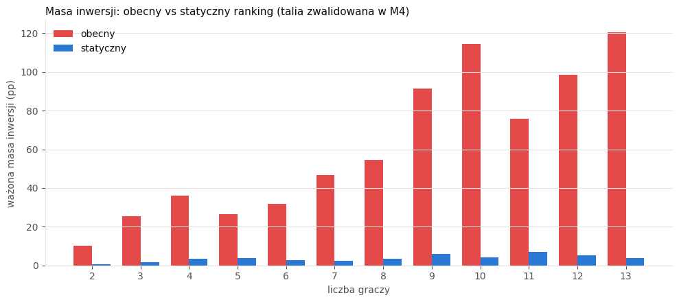
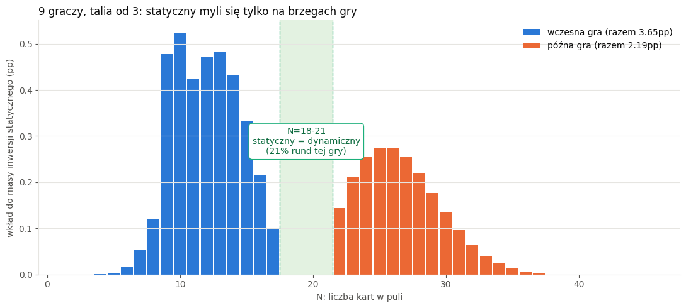
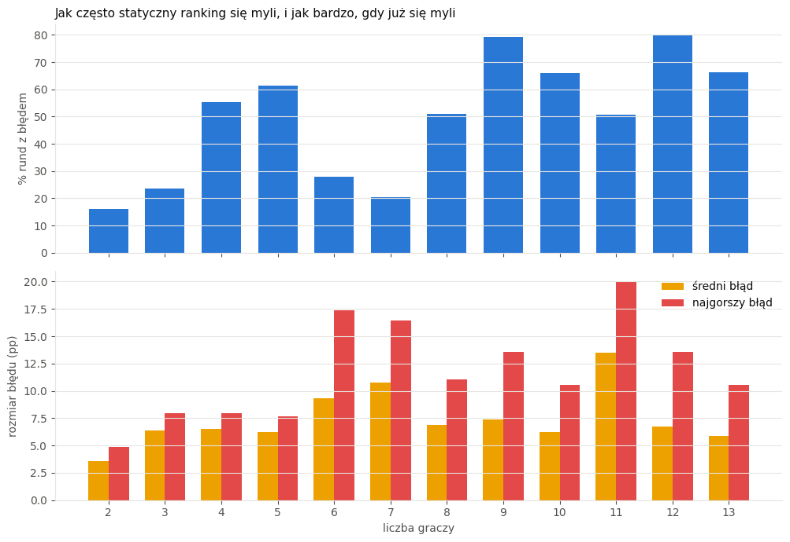
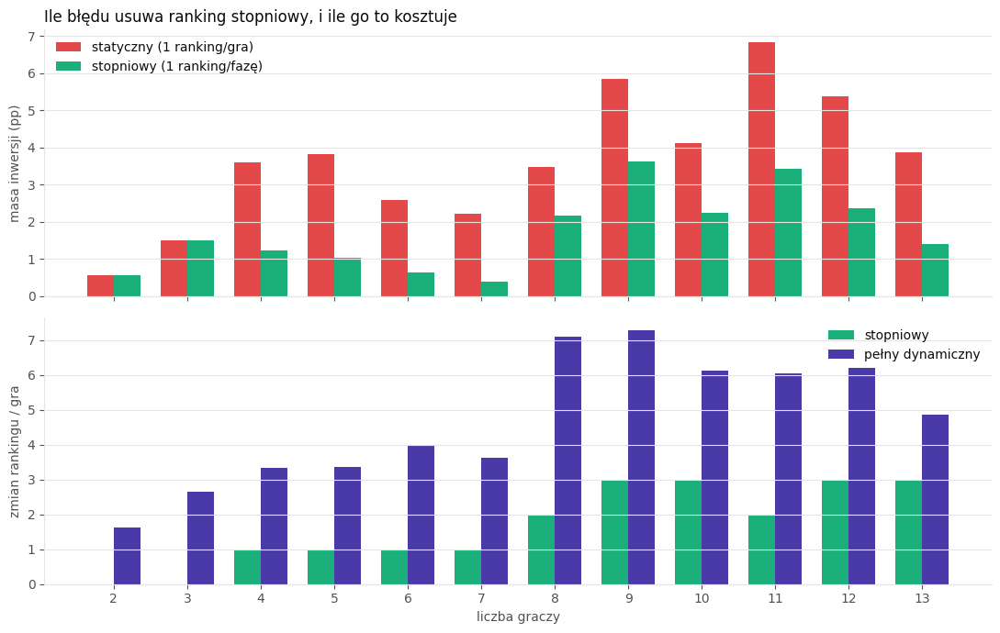
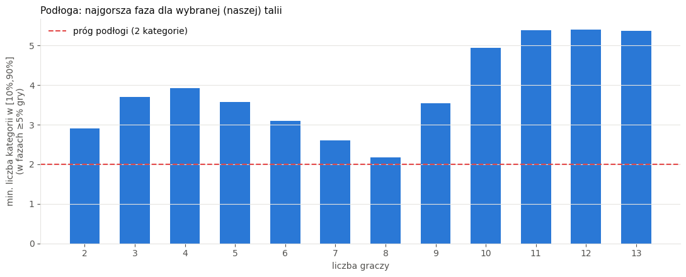
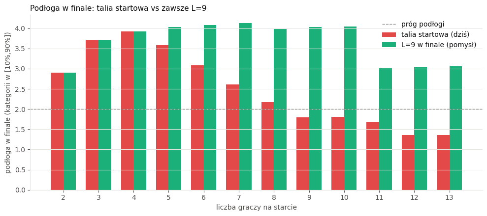
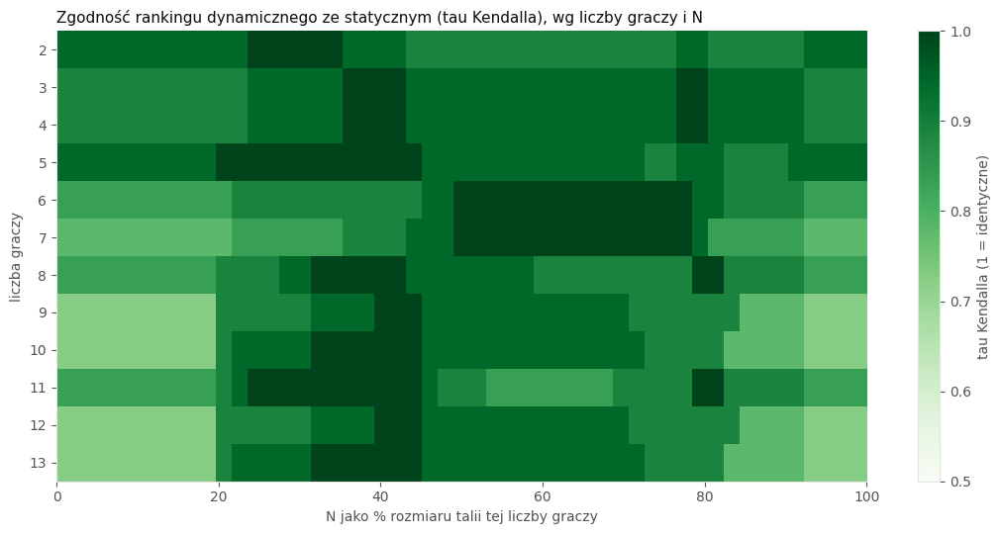

# tayan-lab

Research on whether [Tayan](https://github.com/mateusz-gob1/tayan)'s poker-hand ranking and
deck-size selection are playable across 2-13 players, using exact math (no simulation, no
bots). Every probability is an exact closed-form formula, not an estimate - see
[Method](#method) below.

This README summarizes the findings and recommendations. Full detail, every formula, and the
derivation of every number and chart below live in the notebooks (`notebooks/01`-`05`).

## Method

Every probability `p_c(D, N)` - the chance a given declaration ("pair of aces", "flush",
"straight to king", ...) exists among all players' cards combined, for a deck of size `D` and a
pool of `N` cards - is an **exact closed-form formula** (`notebooks/01_probabilities.ipynb`),
verified against full enumeration, Monte Carlo simulation, classical poker odds, and 82,600
direct comparisons against the game engine's own hand-detection logic (100% agreement).

The distribution of pool size `N` across a whole game is an **exact Markov chain**, not a
simulation (`notebooks/02_pool_size_distribution.ipynb`). Everything downstream - the category
ranking, deck selection, and sensitivity analysis - builds on those two exact foundations. All
code lives in `tayan_lab/`, with 116 passing tests in `tests/`.

## Question 1: is the current category ranking correct?

**No.** The current order is wrong for essentially every player count - its weighted inversion
mass (how much more often a "higher" hand shows up than a "lower" one, weighted by how often
each pool size actually occurs) ranges from ~10pp (2 players) to ~120pp (13 players).

*The lines are p_c(D, N) - the chance a given declaration exists - as the pool size N grows.
Where two lines cross, their rank order flips. The × marks show the first point where a
"stronger" category (by today's order) becomes more common than a "weaker" one - the earliest,
clearest evidence that the current order can't be right for every N. Source: `notebooks/01`.*

**Recommendation: a static ranking** - computed once at game start from the exact formulas,
never recomputed mid-game. It reduces the current order's error by 86-97% for every player
count (see the [final table](#final-recommendation) below).

*Red = today's order, blue = the recommended static ranking. Static is a thin sliver next to
red everywhere. Source: `notebooks/03` section 2.*

A per-round *dynamic* ranking (recomputed every round) was measured and rejected: even in the
minority of rounds where static is imperfect, the benefit doesn't justify reordering the
declared-hand list 2-8 times per game.

*The green band is the "agreement zone" - static and dynamic are identical there. Static only
diverges from dynamic at the start and end of the game. Source: `notebooks/03` section 5b.*

*Top: share of rounds where static disagrees with the per-round-exact ranking by more than the
tie threshold. Bottom: how big that disagreement is, on average and in the worst single round.
Errors are frequent for some player counts but rarely large. Source: `notebooks/03` section 5c.*

A *staged* ranking (2-3 fixed orders switched at elimination thresholds) was also measured - it
would cut the residual error by 38-76% for the weakest cases (4-7 players) - and rejected too,
in favor of the simplicity of one fixed order for the whole game.

*Top: staged (green) always removes some error that static (red) leaves behind. Bottom: staged
needs far fewer mid-game switches than fully dynamic (purple) to get there - real benefit, real
(if smaller) cost, weighed against the value of a single fixed order. Source: `notebooks/03`
section 5d.*

## Question 2: does deck selection avoid extremes (ceiling / floor)?

Recomputing deck choice under this study's own criteria (does the *specific* declaration a
player actually bids appear too often, and is there enough happening at all) gives a **smaller
deck for 8 of 12 player counts** than the game's default table, which is tuned to a different
question ("does *any* four-of-a-kind / straight flush, of any rank, appear too often"). No
degenerate ("dead") phase was found for any recommended deck.

*Every recommended deck clears the floor threshold (dashed line) with margin - the tightest
cases are 7-8 players, still comfortably above it. Source: `notebooks/04` section 3.*

Two refinements were adopted on top of the base deck choice:

- **Starting cards:** raising the "2 starting cards" threshold from ≤6 to **≤7 players** fixes
  a real shortfall for 7 players (13.28% → 4.74% residual error). 5 players has a similar,
  smaller shortfall (14.40%) that no starting-cards choice fixes - accepted as-is, since the
  residual error there is mild in absolute terms (typically 6-7pp per affected round, and the
  final 2-player duel is completely clean).
- **Final-phase deck override:** for **every** player count, switch to the smallest deck (24
  cards) once the game reaches its final 2-player duel - a single, one-time switch. The
  improvement is real for 5-13 players (e.g. 8 players goes from a floor of 2.17 to 4.00); for
  2-4 players it's a zero-cost no-op, since their starting deck is already the smallest one.

  

  *Red = keep the deck the game started with; green = switch to the smallest deck once down to
  2 players. From 5 players up, the starting deck alone leaves the final duel below or only
  barely above the floor threshold - this closes that gap everywhere it exists, at the cost of
  at most one switch. Source: `notebooks/04` section 11.*

## Question 3: does the deck avoid dead phases as players are eliminated?

**Keep a fixed deck for the whole game.** A deck re-chosen at every elimination threshold
("steps", mirroring how the default deck table is indexed by player count) was measured for
every player count: it never removed a dead phase (none exist) and never reached the required
floor gain in the lower half of the game, while costing up to 8 deck changes in a 13-player
game. This is the single most robust conclusion in the whole study - it holds under every
loser-model variant tested (see [sensitivity](#sensitivity-analysis) below).

## Final recommendation

`startingCards`: 2 for players ≤ 7, else 1. `eliminationLimit`: 6 for players ≤ 10, else 5
(unchanged from today). Deck mode: fixed for the whole game, plus the one-time final-duel
override from Question 2, applied at every player count.

| Players | Deck (lowest rank / size) | Category order (weakest → strongest) | Static vs. current error | Sensitivity |
|---|---|---|---|---|
| 2 | 9 / 24 | HIGH, PAIR, STRAIGHT, TWO_PAIR, THREE, FLUSH, FULL, FOUR, STRAIGHT_FLUSH | 5.58% | stable; final-duel override is a no-op here |
| 3 | 9 / 24 | HIGH, PAIR, STRAIGHT, TWO_PAIR, THREE, FULL, FLUSH, FOUR, STRAIGHT_FLUSH | 5.93% | stable; final-duel override is a no-op here |
| 4 | 9 / 24 | HIGH, PAIR, STRAIGHT, TWO_PAIR, THREE, FULL, FLUSH, FOUR, STRAIGHT_FLUSH | 9.99% (borderline) | stable; final-duel override is a no-op here |
| 5 | 8 / 28 | HIGH, PAIR, STRAIGHT, TWO_PAIR, THREE, FLUSH, FULL, FOUR, STRAIGHT_FLUSH | 14.40% (exceeds 10%, accepted) | deck sensitive to loser model; final-duel override applies |
| 6 | 7 / 32 | HIGH, STRAIGHT, PAIR, TWO_PAIR, FLUSH, THREE, FULL, FOUR, STRAIGHT_FLUSH | 8.12% | deck sensitive to loser model; final-duel override applies |
| 7 | 6 / 36 | HIGH, STRAIGHT, PAIR, FLUSH, TWO_PAIR, THREE, FULL, FOUR, STRAIGHT_FLUSH | 4.74% | deck + starting-cards fix sensitive to loser model; final-duel override applies |
| 8 | 5 / 40 | HIGH, PAIR, STRAIGHT, FLUSH, TWO_PAIR, THREE, FULL, FOUR, STRAIGHT_FLUSH | 6.39% | floor margin tight under a narrower [15,85] range; final-duel override applies (biggest single gain of any player count: 2.17 → 4.00) |
| 9 | 3 / 48 | HIGH, FLUSH, PAIR, STRAIGHT, TWO_PAIR, THREE, FULL, FOUR, STRAIGHT_FLUSH | 6.40% | deck sensitive to loser model; final-duel override applies |
| 10 | 2 / 52 | HIGH, FLUSH, PAIR, STRAIGHT, TWO_PAIR, THREE, FULL, FOUR, STRAIGHT_FLUSH | 3.60% | stable; final-duel override applies |
| 11 | 4 / 44 | HIGH, PAIR, STRAIGHT, FLUSH, TWO_PAIR, THREE, FULL, FOUR, STRAIGHT_FLUSH | 9.00% (borderline) | stable; final-duel override applies |
| 12 | 3 / 48 | HIGH, FLUSH, PAIR, STRAIGHT, TWO_PAIR, THREE, FULL, FOUR, STRAIGHT_FLUSH | 5.45% | stable; final-duel override applies |
| 13 | 2 / 52 | HIGH, FLUSH, PAIR, STRAIGHT, TWO_PAIR, THREE, FULL, FOUR, STRAIGHT_FLUSH | 3.22% | stable; final-duel override applies |

("Static vs. current error": the static ranking's weighted inversion mass as a percentage of
the current order's - target: ≤10%. Two rows exceed it and are accepted as-is; see
`notebooks/03` section 7 and `notebooks/04` section 10 for the reasoning.)

## Sensitivity analysis

| Dimension | Tested on | Result |
|---|---|---|
| ε (tie threshold) ∈ {1, 2, 3} pp | deck choice | **Fully stable**, all 12 player counts |
| Ceiling thresholds ±5pp | deck choice | Stable 11/12 - exception: 7 players under the strictest variant needs a bigger deck |
| Floor range ±5pp | deck choice | Stable 11/12 - exception: 8 players fails under the narrowest range (already the tightest floor margin) |
| **Loser model** (uniform / inverse-cards / fewest-cards-always-loses) | deck choice | **Sensitive for 5, 6, 7, 9 players** - the "fewest cards always loses" model systematically needs bigger decks. The only dimension that materially changes a recommendation. |
| Loser model | starting-cards fix (7 players) | **Not fully robust** - works under uniform (4.74%) and inverse-cards (3.22%), fails under fewest-cards (10.92%, still above the bar) |
| Loser model | fixed vs. "steps" deck mode | **Fully stable** - fixed wins under every model tested, for every player count checked. The single most robust conclusion in the study. |

**Why this matters:** the whole study assumes a uniformly random loser each round (matching how
the game currently works - no skill-based or card-count-based bias). That assumption is safe
for the "fixed beats steps" conclusion and for the ranking formulas themselves (which don't
depend on the loser model at all), but the *specific deck size* recommended for 5-9 players
would need to be recomputed if the game ever introduced a different way of picking who loses a
round (e.g. a skill-weighted or catch-up mechanic). Full detail: `notebooks/05_sensitivity.ipynb`.

*Darker green = static and dynamic agree; lighter = they diverge. Every row has a lighter start
and end (early/late game) with a darker middle, though how pronounced that pattern is varies by
player count. Source: `notebooks/05` section 5.*

## Reference scenarios

Three calibration scenarios pass under the recommended settings (`notebooks/04` section 8):

1. Two-player final after a big 13-player game: floor criterion passes.
2. Start of a 2-player game: floor criterion passes.
3. Mid-game of a large game (9 and 13 players), a straight flush should appear no more than
   once every 5 rounds (≤20%): worst observed rate 9.9% and 6.5% respectively - passes with
   margin.

## Notebooks

Each notebook is self-contained: it imports `tayan_lab`, derives its results from scratch, and
explains every formula and chart in prose.

| Notebook | Covers |
|---|---|
| [`01_probabilities.ipynb`](notebooks/01_probabilities.ipynb) | Exact hand-existence formulas, verified 5 independent ways |
| [`02_pool_size_distribution.ipynb`](notebooks/02_pool_size_distribution.ipynb) | Exact distribution of pool size N via a Markov chain; game-phase lengths |
| [`03_rankings.ipynb`](notebooks/03_rankings.ipynb) | Static vs. dynamic vs. staged category ranking, per player count |
| [`04_game_phases_and_deck.ipynb`](notebooks/04_game_phases_and_deck.ipynb) | Deck selection under ceiling/floor criteria; starting cards; the final-duel deck override |
| [`05_sensitivity.ipynb`](notebooks/05_sensitivity.ipynb) | Sensitivity to ε, thresholds, and the loser model; the category-order heatmap |

## Repository map

- `tayan_lab/`: `probabilities.py` (exact hand odds), `pool_size_distribution.py` (Markov
  chain over pool size), `rankings.py` (static/dynamic/staged ranking + measures),
  `game_phases.py` (ceiling/floor evaluation, deck search, deck-mode comparison,
  starting-cards search, final-deck override).
- `tests/`: 116 tests (pytest + hypothesis), including 82,600 cross-checks against the game
  engine's own hand-detection logic (`tests/fixtures/engine_pools.json`).
- `notebooks/`: the full derivation, with every chart, for each stage of the study.
- `assets/`: the charts embedded in this README, exported from the notebooks.

## Setup

    python -m pip install -r requirements.txt
    python -m pip install -e .
    python -m pytest
